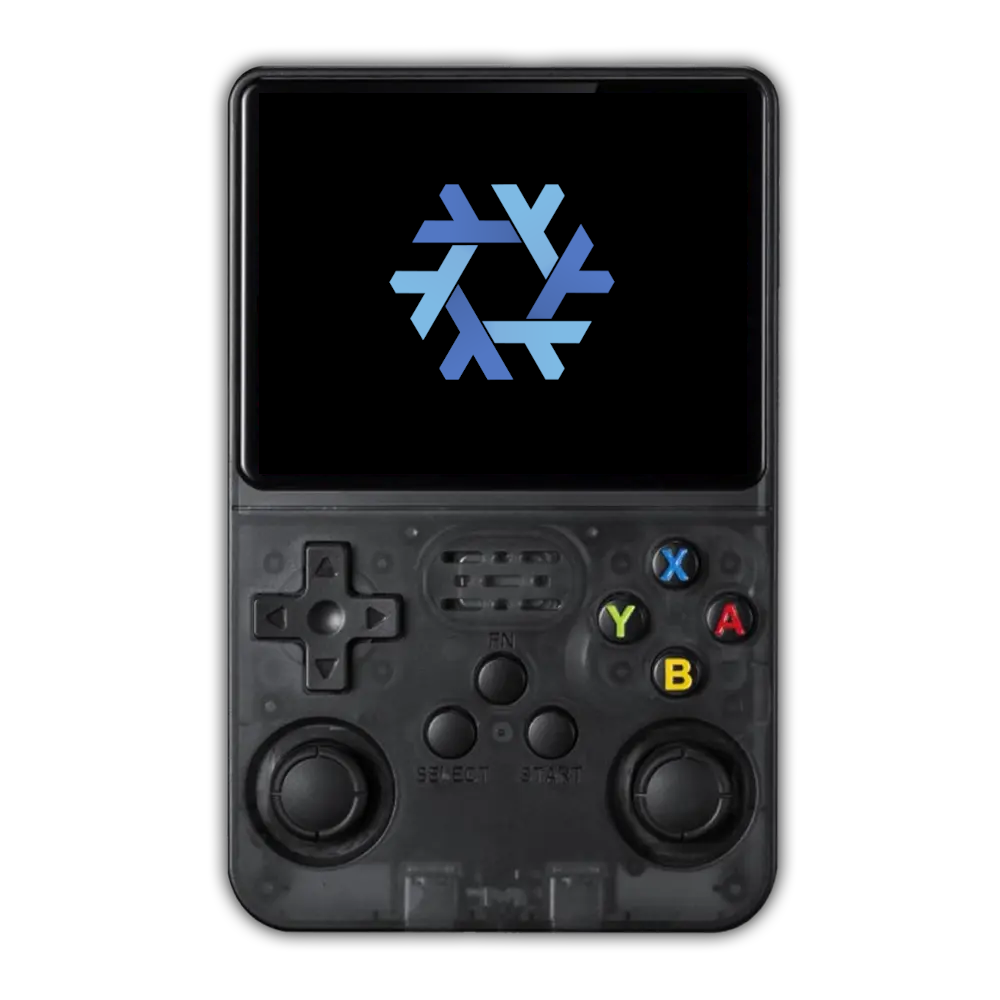

<div align="center">

# NixOS on R36S

**Fully declarative, reproducible NixOS for the R36S handheld gaming console**

[](https://nixos.org)
[](https://kernel.org)
[](https://www.arm.com)
[](LICENSE)



*Cross-compiled SD card image from x86_64. Everything needed to boot — U-Boot, kernel patches, device tree, display driver, and firmware — is self-contained in this repository.*

</div>

---

## Hardware

| | Component | Detail |
|-|-----------|--------|
| | SoC | Rockchip RK3326 (quad Cortex-A35, 1.5 GHz) |
| | RAM | 1 GB DDR3L |
| | GPU | Mali G31 MP2 (Panfrost) |
| | Display | 3.5" 640x480 MIPI DSI (NV3051D, "Panel 4" variant — see [Panel Support](#panel-support)) |
| | Storage | MicroSD (no eMMC) |
| | Input | ADC joysticks (analog via gpio-mux), GPIO buttons |
| | Audio | RK817 PMIC codec over I2S |
| | USB | USB-C (OTG / gadget capable) |
| | Kernel | mainline Linux 6.19+ (nixpkgs `linuxPackages_latest`) |

## Quick Start

### Download a pre-built image

Grab the latest SD card image from the [Releases](https://github.com/icefirex/nixos-r36s/releases) page:

```bash
# Download and decompress
zstd -d nixos-r36s-sd-card.img.zst

# Flash (replace /dev/sdX with your SD card device)
sudo dd if=nixos-r36s-sd-card.img of=/dev/sdX bs=4M status=progress conv=fsync
```

> **Warning:** Double-check the target device. `dd` will silently overwrite whatever you point it at.

Eject the card, insert it into the R36S, and power on.

### Build from source

If you want to customize the configuration or build the image yourself:

**Prerequisites:**
- **NixOS or Nix** with flakes enabled on an x86_64-linux host
- An SD card (16 GB+ recommended; image is ~3.3 GB)

> Cross-compilation is configured in the flake (`buildPlatform = x86_64-linux`, `hostPlatform = aarch64-linux`), so no QEMU or aarch64 hardware is needed for building.

```bash
git clone https://github.com/icefirex/nixos-r36s.git
cd nixos-r36s
nix build .#nixosConfigurations.r36s.config.system.build.sdImage
```

The first build cross-compiles the kernel and takes a while. Subsequent builds are incremental. The output image lands at:

```
./result/sd-image/nixos-image-sd-card-*-aarch64-linux.img
```

Flash it with the same `dd` command as above.

---

## Boot Flow

```
BootROM -> idbloader (sector 64) -> U-Boot
  -> logo.env (panel path config)
  -> PanCho.ini (panel auto-detection)
  -> boot.ini (loads kernel, initrd, DTB from ext4 root)
  -> Linux kernel -> NixOS initrd -> systemd
```

The R36S cannot use mainline U-Boot (no display init, no panel support). This configuration uses a **pre-built Armbian U-Boot** blob that handles early display, panel detection, and SD card boot.

`boot.ini` is generated during image build with the correct Nix store paths baked into the kernel command line. It loads:

| File | Source |
|------|--------|
| `boot/Image` | Kernel |
| `boot/uInitrd` | Initrd (LZ4 compressed) |
| `boot/dtb/rockchip/rk3326-gameconsole-r36s.dtb` | Device tree |
| `ScreenFiles/Panel4/mipi-panel.dtbo` | Panel overlay (applied via `fdt apply`) |

These are fixed-path copies created by `sd-image.nix` because U-Boot's ext4 driver cannot follow symlinks.

---

## Connecting via SSH

The R36S exposes a **USB gadget ethernet** interface over its USB-C port. No network, Wi-Fi, or Bluetooth is required.

### Setup (laptop side)

```bash
# 1. Find the new USB ethernet interface
ip link | grep -E "usb|enp.*u"

# 2. Assign an IP
sudo ip addr add 10.0.0.1/24 dev <interface>
sudo ip link set <interface> up

# 3. Connect (default password: nixos)
ssh root@10.0.0.2
```

### USB Ethernet Instability

The USB gadget ethernet connection can drop due to USB autosuspend. Symptoms: SSH freezes or disconnects after a few minutes of idle.

**On the R36S** — already handled via `usbcore.autosuspend=-1` kernel parameter.

**On the host laptop** — disable autosuspend for the R36S device:

```bash
for d in /sys/bus/usb/devices/*/idVendor; do
  dir=$(dirname "$d")
  if [ "$(cat "$dir/idVendor" 2>/dev/null)" = "0525" ] && \
     [ "$(cat "$dir/idProduct" 2>/dev/null)" = "a4a2" ]; then
    echo -1 | sudo tee "$dir/power/autosuspend"
    echo "on" | sudo tee "$dir/power/control"
  fi
done
```

<details>
<summary>Make it permanent (NixOS udev rule)</summary>

```nix
services.udev.extraRules = ''
  # Disable autosuspend for R36S USB gadget ethernet
  ATTR{idVendor}=="0525", ATTR{idProduct}=="a4a2", ATTR{power/autosuspend}="-1", ATTR{power/control}="on"
'';
```

</details>

<details>
<summary>Reconnect after a drop</summary>

```bash
sudo ip addr flush dev <interface>
sudo ip addr add 10.0.0.1/24 dev <interface>
sudo ip link set <interface> up
```

</details>

### Deploying Configuration Changes over SSH

Once SSH is working, you can deploy NixOS configuration updates without reflashing:

```bash
nixos-rebuild switch --flake .#r36s \
  --target-host root@10.0.0.2 \
  --build-host localhost
```

Everything cross-compiles on the host laptop — the R36S only runs the activation script.

<details>
<summary>What still requires a reflash</summary>

Most changes deploy over SSH. These are baked into the SD image and require reflashing:

- `boot.ini` (U-Boot script on FAT partition)
- U-Boot blob (raw sectors 64+ on SD card)
- FAT partition contents (boot logo, panel firmware files)
- ext4 feature flags (`make-ext4-fs.nix`)

In practice, once the boot chain works, these rarely change.

</details>

---

## Repository Structure

```
nixos-r36s/
├── flake.nix                 # Flake entry point (cross-compilation, deploy-rs)
├── flake.lock
├── configuration.nix         # System config (SSH, swap, packages)
├── r36s-hardware.nix         # Hardware config (kernel, drivers, device tree, USB gadget)
├── sd-image.nix              # SD image layout (boot.ini, FAT/ext4 partitions, U-Boot)
├── make-ext4-fs.nix          # Patched ext4 builder (disables features U-Boot can't read)
├── blobs/
│   └── u-boot-rockchip.bin   # Pre-built Armbian U-Boot (written to sector 64)
├── drivers/
│   ├── panel-generic-dsi.c   # Out-of-tree MIPI DSI panel driver (from ROCKNIX)
│   └── Makefile
├── dts/
│   └── rk3326-r36s.dts       # R36S device tree source
├── patches/
│   └── 0001-add-r36s-device-tree.patch
└── assets/
    ├── boot-logo.bmp          # U-Boot splash logo
    └── firmware/
        ├── logo.env           # Panel path config for U-Boot
        ├── PanCho.ini         # Armbian panel auto-detection script
        └── ScreenFiles/
            └── Panel4/
                ├── mipi-panel.dtbo
                └── rg351mp-kernel.dtb
```

---

## Design Decisions

### Armbian U-Boot

Mainline U-Boot does not support the R36S display or the Armbian-style boot flow. The pre-built blob (`blobs/u-boot-rockchip.bin`) is extracted from an official Armbian R36S image and provides display init, panel auto-detection, ext4 read support, and `boot.ini` script execution.

### Custom ext4 Builder

U-Boot's ext4 driver chokes on modern features. `make-ext4-fs.nix` creates the root filesystem with `-O ^metadata_csum,^64bit,^orphan_file`.

### Out-of-Tree Panel Driver

The mainline `panel_newvision_nv3051d` driver lacks the R36S-specific init sequence. The `panel-generic-dsi` driver from ROCKNIX reads init sequences from the device tree and is blacklisted against the mainline driver.

### Panel Support

> **This configuration currently only supports the Panel 4 variant (NV3051D).**

The R36S ships with several different display panels depending on manufacturing batch:

| Panel | Status |
|-------|--------|
| Panel 4 (NV3051D) | **Supported** |
| Panel 1, 2, 3 | Not yet supported |
| Original | Not yet supported |
| RGB20S | Not yet supported |

The Armbian U-Boot includes a panel chooser (`PanCho.ini`) that supports all variants via **R1 + D-pad** at boot, but only the Panel 4 overlay and DTB files are currently included. Supporting additional panels requires adding the corresponding `ScreenFiles/Panel <N>/` directories and device tree overlays.

To check which panel your R36S has, hold **R1** during boot — if the U-Boot splash displays correctly with the default config, you have Panel 4.

### FAT Partition Quirks

The Armbian U-Boot expects `ScreenFiles/Panel 4/` (with a space). The nixpkgs FAT builder breaks on spaces, so the build uses `mtools` (`mmd`/`mcopy` with `@@offset`) to write the space-named directory directly to the raw FAT partition.

### Boot Optimizations

| Optimization | Effect |
|---|---|
| LZ4 initrd compression | Faster decompression on Cortex-A35 |
| Display modules in initrd | DRM framebuffer at ~5s (no screen glitch) |
| No linux-firmware | No WiFi/BT; Panfrost needs no firmware |
| Disabled services | No firewall, nscd, audit, documentation |
| Single getty + auto-login | Minimal TTY overhead |
| zram swap (50%) | Critical with only 1 GB RAM |

---

## Default Configuration

| Setting | Value |
|---------|-------|
| Hostname | `r36s` |
| Root password | `nixos` |
| SSH | Enabled (port 22, root login allowed) |
| USB gadget IP | `10.0.0.2/24` |
| Swap | zram (50% of RAM) |
| DHCP | Disabled |
| Kernel | `linuxPackages_latest` (mainline) |

## Kernel Modules

| Module | Purpose |
|--------|---------|
| `rockchipdrm` | DRM/KMS display driver (VOP + DW MIPI DSI) |
| `panel_generic_dsi` | Out-of-tree MIPI DSI panel driver (ROCKNIX) |
| `phy_rockchip_inno_dsidphy` | DSI D-PHY |
| `panfrost` | Open-source Mali GPU driver |
| `joypad_adc` | ADC joystick input |
| `mux_gpio` / `iio_mux` | GPIO multiplexer for analog sticks |
| `rockchip_saradc` | Rockchip SAR ADC |
| `keyboard_gpio` | GPIO button input |
| `snd_soc_rockchip_i2s` / `snd_soc_rk817` | Audio (I2S + RK817 codec) |
| `g_ether` | USB gadget ethernet |

Display modules are loaded in the initrd for early framebuffer support.

---

## Troubleshooting

<details>
<summary><b>Boot Diagnostics</b></summary>

The `boot.ini` script writes stage marker files to the FAT partition during boot. Mount the SD card's first partition and check for:

| File | Meaning |
|------|---------|
| `stage1-bootini.ok` | boot.ini started executing |
| `stage2-kernel.ok` | Kernel loaded from ext4 |
| `stage3-initrd.ok` | Initrd loaded from ext4 |
| `stage4-dtb.ok` | Device tree loaded from ext4 |
| `stage5-booti.ok` | About to jump to kernel (`booti`) |
| `stage6-booti-failed.err` | `booti` returned (kernel failed to start) |
| `FAILED.txt` | Boot script fell through entirely |

The *last* stage file present tells you where boot failed. If none exist, `boot.ini` never ran.

</details>

<details>
<summary><b>No Display Output</b></summary>

- Verify `boot-logo.bmp` and `ScreenFiles/Panel 4/` exist on the FAT partition
- The Armbian U-Boot loads `rg351mp-kernel.dtb` for its splash screen — if missing, U-Boot may error out silently

</details>

<details>
<summary><b>SSH Not Working</b></summary>

1. Check the USB device appears: `lsusb | grep 0525:a4a2`
2. Check the network interface: `ip link`
3. Assign host IP: `sudo ip addr add 10.0.0.1/24 dev <interface> && sudo ip link set <interface> up`
4. If the interface vanishes, see [USB Ethernet Instability](#usb-ethernet-instability)

</details>

---

## License

- NixOS configuration files: MIT
- `panel-generic-dsi.c`: GPL-2.0-only (from [ROCKNIX](https://github.com/ROCKNIX))
- `u-boot-rockchip.bin`: GPL-2.0 ([Armbian](https://www.armbian.com/) / Das U-Boot)
- Armbian firmware assets (`PanCho.ini`, panel overlays): GPL-2.0 (Armbian)
- NixOS logo: CC-BY ([NixOS/nixos-artwork](https://github.com/NixOS/nixos-artwork))
